# Sistem Manajemen Inventaris dan Aset

Aplikasi manajemen inventaris dan aset tetap yang komprehensif, dibangun dengan Laravel 12 dan Filament v4. Aplikasi ini dirancang untuk mengelola barang persediaan (inventory) dan aset tetap dengan pelacakan stok real-time dan audit trail yang lengkap.

## Fitur Utama

### Manajemen Inventaris
- **Pelacakan Stok Real-time**: Stok barang diperbarui secara otomatis saat terjadi transaksi
- **Identifikasi Unik**: Setiap barang diidentifikasi dengan nama yang unik
- **Kategori Fleksibel**: Dukungan kategori bertipe aset, inventaris, keduanya, atau lainnya
- **Multi-Satuan**: Dukungan berbagai satuan ukuran (pcs, kg, meter, dll)
- **Validasi Stok**: Mencegah stok negatif dengan validasi otomatis

### Manajemen Aset Tetap
- **Register Aset**: Pencatatan aset tetap perusahaan
- **Pelacakan Pembelian**: Harga, tanggal pembelian, dan kondisi aset
- **Kategorisasi**: Pengelompokan aset berdasarkan kategori

### Gerak Barang (Stock Movement)
- **Barang Masuk**: Pencatatan barang yang masuk ke gudang
- **Barang Keluar**: Pencatatan barang yang keluar dari gudang
- **Audit Trail**: Riwayat lengkap setiap transaksi
- **Lampiran**: Dukungan upload dokumen/bukti transaksi

### Keamanan & Otorisasi
- **Role-Based Access Control**: Menggunakan Spatie Shield
- **Policy-Based Authorization**: Kebijakan akses per model
- **User Responsibility**: Setiap transaksi terhubung dengan pengguna

## Teknologi

- **PHP**: 8.3.6
- **Laravel**: 12.x
- **Filament**: 4.x (Admin Panel)
- **Livewire**: 3.x
- **Tailwind CSS**: 4.x
- **MySQL**: Database

## Struktur Database

### Tabel Utama

#### Master Data
- `users` - Pengguna aplikasi
- `categories` - Kategori barang dan aset
- `units` - Satuan ukuran barang
- `items` - Data barang/inventaris
- `assets` - Data aset tetap

#### Transaksi
- `stock_movements` - Header transaksi barang masuk/keluar
- `stock_movement_items` - Detail item dalam setiap transaksi

### Entity Relationship Diagram (ERD)

```mermaid
erDiagram
    %% Master Data Tables
    User ||--o{ StockMovement : creates
    Category ||--o{ Item : categorizes
    Category ||--o{ Asset : categorizes
    Unit ||--o{ Item : measures

    %% Transaction Tables
    StockMovement ||--o{ StockMovementItem : contains
    Item ||--o{ StockMovementItem : "tracked in"

    %% User Table
    User {
        bigint id PK
        string name
        string email
        timestamp email_verified_at
        string password
        remember_token
        timestamps
    }

    %% Category Table
    Category {
        bigint id PK
        string name
        enum type[asset, inventory, both, other]
        timestamps
    }

    %% Unit Table
    Unit {
        bigint id PK
        string name
        timestamps
    }

    %% Item Table
    Item {
        bigint id PK
        string name UK
        string stock
        bigint unit_id FK
        bigint category_id FK
        text description
        timestamps
    }

    %% Asset Table
    Asset {
        bigint id PK
        string name
        bigint category_id FK
        decimal purchase_price
        date purchase_date
        string condition
        text notes
        timestamps
    }

    %% StockMovement Table
    StockMovement {
        bigint id PK
        date movement_date
        enum type[in, out]
        string source
        text notes
        bigint created_by FK
        json attachments
        timestamps
    }

    %% StockMovementItem Table
    StockMovementItem {
        bigint id PK
        bigint stock_movement_id FK
        bigint item_id FK
        decimal quantity
        timestamps
    }
```

### Relasi
```
Category (1) → (N) Item
Category (1) → (N) Asset
Unit (1) → (N) Item
User (1) → (N) StockMovement
StockMovement (1) → (N) StockMovementItem
Item (1) → (N) StockMovementItem
```

## Use Case Diagram

```mermaid
flowchart TD
    %% Actors
    Admin[Admin]
    Staff[Staf Gudang]
    Manager[Manager]
    System[(Sistem Inventaris)]

    %% Authentication
    Admin -->|Login| System
    Staff -->|Login| System
    Manager -->|Login| System

    %% Master Data Management - Admin & Staff
    Admin -->|Kelola Kategori| System
    Admin -->|Kelola Satuan| System
    Admin -->|Kelola Barang| System
    Admin -->|Kelola Aset| System
    Staff -->|Lihat Data Master| System
    Manager -->|Lihat Data Master| System

    %% Stock Movement - Admin & Staff
    Admin -->|Catat Barang Masuk| System
    Admin -->|Catat Barang Keluar| System
    Staff -->|Catat Barang Masuk| System
    Staff -->|Catat Barang Keluar| System
    Manager -->|Lihat Laporan Gerak Barang| System

    %% User Management - Admin Only
    Admin -->|Kelola Pengguna| System
    Admin -->|Atur Hak Akses| System

    %% Dashboard & Reports - All Users
    Admin -->|Lihat Dashboard| System
    Staff -->|Lihat Dashboard| System
    Manager -->|Lihat Dashboard| System
    Admin -->|Lihat Ringkasan Aset| System
    Staff -->|Lihat Ringkasan Aset| System
    Manager -->|Lihat Ringkasan Aset| System
    Admin -->|Lihat Alert Stok Menipis| System
    Staff -->|Lihat Alert Stok Menipis| System
    Manager -->|Lihat Alert Stok Menipis| System

    %% Export Data
    Admin -->|Export Data| System
    Manager -->|Export Laporan| System

    %% Styling
    classDef actorStyle fill:#e1f5ff,stroke:#01579b,stroke-width:2px
    classDef systemStyle fill:#f3e5f5,stroke:#4a148c,stroke-width:2px
    classDef useCaseStyle fill:#fff3e0,stroke:#e65100,stroke-width:1px

    class Admin,Staff,Manager actorStyle
    class System systemStyle
```



### Deskripsi Use Case

| Use Case | Deskripsi | Actor |
|----------|-----------|-------|
| Login | Masuk ke sistem dengan kredensial | Admin, Staff, Manager |
| Kelola Kategori | CRUD kategori barang dan aset | Admin |
| Kelola Satuan | CRUD satuan ukuran | Admin |
| Kelola Barang | CRUD data barang inventaris | Admin |
| Kelola Aset | CRUD data aset tetap | Admin |
| Catat Barang Masuk | Mencatat transaksi barang masuk | Admin, Staff |
| Catat Barang Keluar | Mencatat transaksi barang keluar | Admin, Staff |
| Kelola Pengguna | Manajemen akun pengguna | Admin |
| Atur Hak Akses | Pengaturan role dan permission | Admin |
| Lihat Dashboard | Melihat ringkasan statistik | Admin, Staff, Manager |
| Lihat Ringkasan Aset | Melihat statistik aset | Admin, Staff, Manager |
| Lihat Alert Stok | Melihat peringatan stok menipis | Admin, Staff, Manager |
| Export Data | Export data ke Excel/PDF | Admin, Manager |

## Class Diagram

```mermaid
classDiagram
    %% Models
    class User {
        +bigint id
        +string name
        +string email
        +string password
        +timestamp email_verified_at
        +string remember_token
        +timestamps()
        +stockMovements() HasMany
    }

    class Category {
        +bigint id
        +string name
        +string type
        +timestamps()
        +items() HasMany
        +assets() HasMany
    }

    class Unit {
        +bigint id
        +string name
        +timestamps()
        +items() HasMany
    }

    class Item {
        +string name
        +string stock
        +bigint unit_id
        +bigint category_id
        +text description
        +timestamps()
        +unit() BelongsTo
        +category() BelongsTo
        +stockMovementItems() HasMany
    }

    class Asset {
        +bigint id
        +string name
        +bigint category_id
        +decimal purchase_price
        +date purchase_date
        +string condition
        +text notes
        +timestamps()
        +casts() array
        +category() BelongsTo
    }

    class StockMovement {
        +date movement_date
        +string type
        +string source
        +text notes
        +bigint created_by
        +json attachments
        +timestamps()
        +casts() array
        +createdBy() BelongsTo
        +items() HasMany
    }

    class StockMovementItem {
        +bigint stock_movement_id
        +bigint item_id
        +decimal quantity
        +timestamps()
        +stockMovement() BelongsTo
        +item() BelongsTo
    }

    %% Observers
    class StockMovementItemObserver {
        +created(StockMovementItem) void
        +updated(StockMovementItem) void
        +deleted(StockMovementItem) void
        -updateStock(StockMovementItem, string) void
        -handleUpdate(StockMovementItem, Item) void
        -adjustStock(Item, decimal, string, bool) void
    }

    class StockMovementObserver {
        +deleted(StockMovement) void
    }

    %% Widgets
    class StatsOverview {
        +getColumns() int
        +getStats() array
    }

    class LowStockAlertWidget {
        +getColumns() int
        +getStats() array
    }

    class AssetStatsOverviewWidget {
        +table(Table) Table
    }

    class RecentStockMovements {
        +table(Table) Table
    }

    %% Filament Resources
    class CategoryResource {
        +form(Schema) Schema
        +table(Table) Table
    }

    class ItemResource {
        +form(Schema) Schema
        +table(Table) Table
        +infolist(Infolist) Infolist
    }

    class AssetResource {
        +form(Schema) Schema
        +table(Table) Table
        +infolist(Infolist) Infolist
    }

    class StockInResource {
        +form(Schema) Schema
        +table(Table) Table
        +infolist(Infolist) Infolist
    }

    class StockOutResource {
        +form(Schema) Schema
        +table(Table) Table
        +infolist(Infolist) Infolist
    }

    class UserResource {
        +form(Schema) Schema
        +table(Table) Table
    }

    %% Policies
    class AssetPolicy {
        +viewAny(User) bool
        +view(User, Asset) bool
        +create(User) bool
        +update(User, Asset) bool
        +delete(User, Asset) bool
    }

    class ItemPolicy {
        +viewAny(User) bool
        +view(User, Item) bool
        +create(User) bool
        +update(User, Item) bool
        +delete(User, Item) bool
    }

    class StockMovementPolicy {
        +viewAny(User) bool
        +view(User, StockMovement) bool
        +create(User) bool
        +update(User, StockMovement) bool
        +delete(User, StockMovement) bool
    }

    class CategoryPolicy {
        +viewAny(User) bool
        +view(User, Category) bool
        +create(User) bool
        +update(User, Category) bool
        +delete(User, Category) bool
    }

    class UserPolicy {
        +viewAny(User) bool
        +view(User, User) bool
        +create(User) bool
        +update(User, User) bool
        +delete(User, User) bool
    }

    %% Relationships
    User "1" --> "*" StockMovement : creates
    Category "1" --> "*" Item : categorizes
    Category "1" --> "*" Asset : categorizes
    Unit "1" --> "*" Item : measures
    StockMovement "1" --> "*" StockMovementItem : contains
    Item "1" --> "*" StockMovementItem : tracked in
    StockMovementItemObserver ..> StockMovementItem : observes
    StockMovementObserver ..> StockMovement : observes

    %% Styling
    classDef modelStyle fill:#e3f2fd,stroke:#1565c0,stroke-width:2px
    classDef observerStyle fill:#fff3e0,stroke:#e65100,stroke-width:2px
    classDef widgetStyle fill:#f3e5f5,stroke:#7b1fa2,stroke-width:2px
    classDef resourceStyle fill:#e8f5e9,stroke:#2e7d32,stroke-width:2px
    classDef policyStyle fill:#fce4ec,stroke:#c2185b,stroke-width:2px

    class User,Category,Unit,Item,Asset,StockMovement,StockMovementItem modelStyle
    class StockMovementItemObserver,StockMovementObserver observerStyle
    class StatsOverview,LowStockAlertWidget,AssetStatsOverviewWidget,RecentStockMovements widgetStyle
    class CategoryResource,ItemResource,AssetResource,StockInResource,StockOutResource,UserResource resourceStyle
    class AssetPolicy,ItemPolicy,StockMovementPolicy,CategoryPolicy,UserPolicy policyStyle
```

## Resource Filament

### Data Master
1. **Kategori** (`/admin/kategori`)
   - Manajemen kategori barang dan aset
   - Tipe: aset, inventaris, keduanya, atau lainnya

2. **Barang** (`/admin/barang`)
   - Manajemen data barang inventaris
   - CRUD lengkap dengan formulir dan tabel
   - Menampilkan level stok saat ini

3. **Aset Tetap** (`/admin/aset-tetap`)
   - Manajemen aset tetap perusahaan
   - Pelacakan detail pembelian dan kondisi

### Sirkulasi Barang
4. **Barang Masuk** (`/admin/barang-masuk`)
   - Pencatatan barang masuk
   - Filter menampilkan hanya transaksi tipe 'in'

5. **Barang Keluar** (`/admin/barang-keluar`)
   - Pencatatan barang keluar
   - Filter menampilkan hanya transaksi tipe 'out'

### Manajemen Pengguna
6. **Akun Pengguna** (`/admin/akun-pengguna`)
   - Manajemen akun pengguna
   - Integrasi dengan role-based permissions

## Instalasi

1. Clone repository
```bash
git clone <repository-url>
cd barang
```

2. Install dependencies
```bash
composer install
npm install
```

3. Setup environment
```bash
cp .env.example .env
php artisan key:generate
```

4. Configure database di `.env`
```
DB_DATABASE=barang
DB_USERNAME=root
DB_PASSWORD=
```

5. Run migration & seeder
```bash
php artisan migrate --seed
```

6. Build assets
```bash
npm run build
```

7. Start development server
```bash
php artisan serve
```

## Penggunaan

### Login
Akses aplikasi di `/admin` dan gunakan kredensial dari seeder.

### Menambah Barang
1. Buka menu **Barang** di sidebar
2. Klik tombol **Tambah**
3. Isi nama barang, pilih kategori dan satuan
4. Stok awal dapat diisi langsung

### Mencatat Barang Masuk
1. Buka menu **Barang Masuk**
2. Klik **Tambah Barang Masuk**
3. Pilih tanggal, sumber, dan catatan
4. Tambah item dan jumlahnya
5. Upload lampiran jika diperlukan
6. Stok barang akan diperbarui otomatis

### Mencatat Barang Keluar
1. Buka menu **Barang Keluar**
2. Klik **Tambah Barang Keluar**
3. Pilih tanggal, tujuan, dan catatan
4. Tambah item dan jumlahnya
5. Upload lampiran jika diperlukan
6. Stok barang akan berkurang otomatis

## Observers

Aplikasi menggunakan observers untuk automasi bisnis:

### StockMovementItemObserver
- Menyesuaikan stok barang saat item transaksi dibuat
- Menyesuaikan stok saat item transaksi diubah
- Menyesuaikan stok saat item transaksi dihapus
- Mencegah stok negatif
- Menggunakan quiet updates untuk menghindari loop observer

### StockMovementObserver
- Membersihkan data saat header transaksi dihapus
- Menangani logika bisnis kustom

## Kontribusi

1. Fork repository
2. Buat branch fitur (`git checkout -b feature/AmazingFeature`)
3. Commit perubahan (`git commit -m 'Add some AmazingFeature'`)
4. Push ke branch (`git push origin feature/AmazingFeature`)
5. Buka Pull Request

## Lisensi

Aplikasi ini adalah software proprietary. Hak cipta dilindungi undang-undang.

## Dukungan

Untuk pertanyaan dan dukungan, hubungi tim pengembang.
