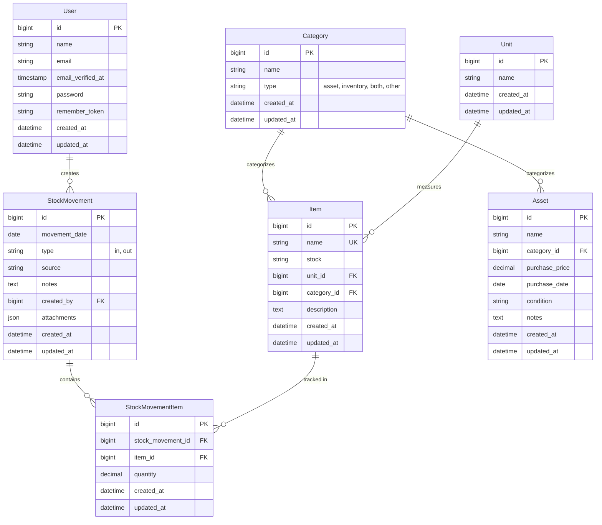
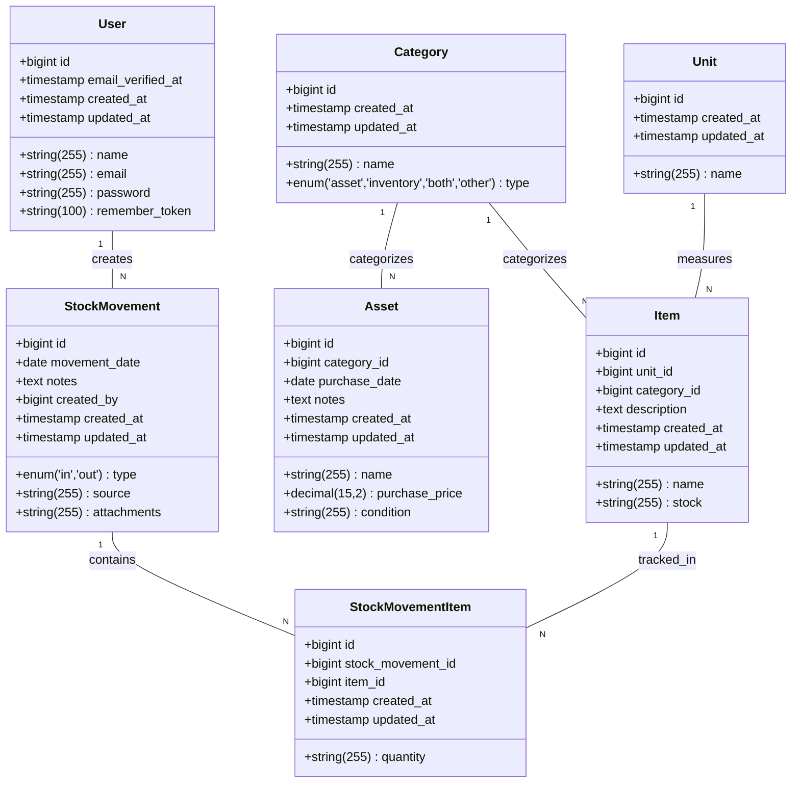

# Sistem Manajemen Inventaris dan Aset

Aplikasi manajemen inventaris dan aset tetap yang komprehensif, dibangun dengan Laravel 12 dan Filament v4. Aplikasi ini dirancang untuk mengelola barang persediaan (inventory) dan aset tetap dengan pelacakan stok real-time dan audit trail yang lengkap.

## Fitur Utama

### Manajemen Inventaris
- **Pelacakan Stok Real-time**: Stok barang diperbarui secara otomatis saat terjadi transaksi
- **Identifikasi Unik**: Setiap barang diidentifikasi dengan nama yang unik
- **Kategori Fleksibel**: Dukungan kategori bertipe aset, inventaris, keduanya, atau lainnya
- **Multi-Satuan**: Dukungan berbagai satuan ukuran (pcs, kg, meter, dll)
- **Validasi Stok**: Mencegah stok negatif dengan validasi otomatis

### Manajemen Aset Tetap
- **Register Aset**: Pencatatan aset tetap perusahaan
- **Pelacakan Pembelian**: Harga, tanggal pembelian, dan kondisi aset
- **Kategorisasi**: Pengelompokan aset berdasarkan kategori

### Gerak Barang (Stock Movement)
- **Barang Masuk**: Pencatatan barang yang masuk ke gudang
- **Barang Keluar**: Pencatatan barang yang keluar dari gudang
- **Audit Trail**: Riwayat lengkap setiap transaksi
- **Lampiran**: Dukungan upload dokumen/bukti transaksi

### Keamanan & Otorisasi
- **Role-Based Access Control**: Menggunakan Spatie Shield
- **Policy-Based Authorization**: Kebijakan akses per model
- **User Responsibility**: Setiap transaksi terhubung dengan pengguna

## Teknologi

- **PHP**: 8.3.6
- **Laravel**: 12.x
- **Filament**: 4.x (Admin Panel)
- **Livewire**: 3.x
- **Tailwind CSS**: 4.x
- **MySQL**: Database

## Struktur Database

### Detail Tabel

#### 1. users
Tabel ini menyimpan data pengguna aplikasi.

| Field | Tipe Data | Panjang | Relasi | Keterangan |
|---|---|---|---|---|
| id (PK) | bigint | 20 | - | Primary Key |
| name | string | 255 | - | Nama lengkap pengguna |
| email | string | 255 | - | Alamat email (Unique) |
| email_verified_at | timestamp | - | - | Waktu verifikasi email |
| password | string | 255 | - | Password terenkripsi |
| remember_token | string | 100 | - | Token "Remember Me" |
| created_at | timestamp | - | - | Waktu pembuatan data |
| updated_at | timestamp | - | - | Waktu pembaruan data |

#### 2. categories
Tabel ini mengelompokkan barang dan aset.

| Field | Tipe Data | Panjang | Relasi | Keterangan |
|---|---|---|---|---|
| id (PK) | bigint | 20 | - | Primary Key |
| name | string | 255 | - | Nama kategori |
| type | enum | - | - | Tipe kategori ('asset', 'inventory', 'both', 'other') |
| created_at | timestamp | - | - | Waktu pembuatan data |
| updated_at | timestamp | - | - | Waktu pembaruan data |

#### 3. units
Tabel ini menyimpan satuan ukuran untuk barang.

| Field | Tipe Data | Panjang | Relasi | Keterangan |
|---|---|---|---|---|
| id (PK) | bigint | 20 | - | Primary Key |
| name | string | 255 | - | Nama satuan (misal: pcs, kg) |
| created_at | timestamp | - | - | Waktu pembuatan data |
| updated_at | timestamp | - | - | Waktu pembaruan data |

#### 4. items
Tabel ini menyimpan data master barang inventaris.

| Field | Tipe Data | Panjang | Relasi | Keterangan |
|---|---|---|---|---|
| id (PK) | bigint | 20 | - | Primary Key |
| name | string | 255 | - | Nama barang |
| stock | string | 255 | - | Jumlah stok saat ini |
| unit_id (FK) | bigint | 20 | units.id | ID Satuan barang |
| category_id (FK) | bigint | 20 | categories.id | ID Kategori barang |
| description | text | - | - | Deskripsi tambahan |
| created_at | timestamp | - | - | Waktu pembuatan data |
| updated_at | timestamp | - | - | Waktu pembaruan data |

#### 5. assets
Tabel ini menyimpan data aset tetap perusahaan.

| Field | Tipe Data | Panjang | Relasi | Keterangan |
|---|---|---|---|---|
| id (PK) | bigint | 20 | - | Primary Key |
| name | string | 255 | - | Nama aset |
| category_id (FK) | bigint | 20 | categories.id | ID Kategori aset |
| purchase_price | decimal | 15,2 | - | Harga pembelian |
| purchase_date | date | - | - | Tanggal pembelian |
| condition | string | 255 | - | Kondisi aset |
| notes | text | - | - | Catatan tambahan |
| created_at | timestamp | - | - | Waktu pembuatan data |
| updated_at | timestamp | - | - | Waktu pembaruan data |

#### 6. stock_movements
Tabel header untuk transaksi keluar masuk barang.

| Field | Tipe Data | Panjang | Relasi | Keterangan |
|---|---|---|---|---|
| id (PK) | bigint | 20 | - | Primary Key |
| movement_date | date | - | - | Tanggal transaksi |
| type | enum | - | - | Tipe transaksi ('in', 'out') |
| source | string | 255 | - | Sumber/Tujuan barang |
| attachments | string | 255 | - | Path file lampiran |
| notes | text | - | - | Catatan transaksi |
| created_by (FK) | bigint | 20 | users.id | User yang membuat transaksi |
| created_at | timestamp | - | - | Waktu pembuatan data |
| updated_at | timestamp | - | - | Waktu pembaruan data |

#### 7. stock_movement_items
Tabel detail item dalam setiap transaksi stok.

| Field | Tipe Data | Panjang | Relasi | Keterangan |
|---|---|---|---|---|
| id (PK) | bigint | 20 | - | Primary Key |
| stock_movement_id (FK) | bigint | 20 | stock_movements.id | ID Header transaksi |
| item_id (FK) | bigint | 20 | items.id | ID Barang |
| quantity | string | 255 | - | Jumlah barang dalam transaksi |
| created_at | timestamp | - | - | Waktu pembuatan data |
| updated_at | timestamp | - | - | Waktu pembaruan data |

### Entity Relationship Diagram (ERD)



### Relasi
```
Category (1) → (N) Item
Category (1) → (N) Asset
Unit (1) → (N) Item
User (1) → (N) StockMovement
StockMovement (1) → (N) StockMovementItem
Item (1) → (N) StockMovementItem
```

## Use Case Diagram

```mermaid
flowchart TD
    %% Actors
    Admin[Admin]
    Staff[Staf Gudang]
    Manager[Manager]
    System[(Sistem Inventaris)]

    %% Authentication
    Admin -->|Login| System
    Staff -->|Login| System
    Manager -->|Login| System

    %% Master Data Management - Admin & Staff
    Admin -->|Kelola Kategori| System
    Admin -->|Kelola Satuan| System
    Admin -->|Kelola Barang| System
    Admin -->|Kelola Aset| System
    Staff -->|Lihat Data Master| System
    Manager -->|Lihat Data Master| System

    %% Stock Movement - Admin & Staff
    Admin -->|Catat Barang Masuk| System
    Admin -->|Catat Barang Keluar| System
    Staff -->|Catat Barang Masuk| System
    Staff -->|Catat Barang Keluar| System
    Manager -->|Lihat Laporan Gerak Barang| System

    %% User Management - Admin Only
    Admin -->|Kelola Pengguna| System
    Admin -->|Atur Hak Akses| System

    %% Dashboard & Reports - All Users
    Admin -->|Lihat Dashboard| System
    Staff -->|Lihat Dashboard| System
    Manager -->|Lihat Dashboard| System
    Admin -->|Lihat Ringkasan Aset| System
    Staff -->|Lihat Ringkasan Aset| System
    Manager -->|Lihat Ringkasan Aset| System
    Admin -->|Lihat Alert Stok Menipis| System
    Staff -->|Lihat Alert Stok Menipis| System
    Manager -->|Lihat Alert Stok Menipis| System

    %% Export Data
    Admin -->|Export Data| System
    Manager -->|Export Laporan| System

    %% Styling
    classDef actorStyle fill:#e1f5ff,stroke:#01579b,stroke-width:2px
    classDef systemStyle fill:#f3e5f5,stroke:#4a148c,stroke-width:2px
    classDef useCaseStyle fill:#fff3e0,stroke:#e65100,stroke-width:1px

    class Admin,Staff,Manager actorStyle
    class System systemStyle
```



### Deskripsi Use Case

| Use Case | Deskripsi | Actor |
|----------|-----------|-------|
| Login | Masuk ke sistem dengan kredensial | Admin, Staff, Manager |
| Kelola Kategori | CRUD kategori barang dan aset | Admin |
| Kelola Barang | CRUD data barang inventaris | Admin |
| Kelola Aset | CRUD data aset tetap | Admin |
| Catat Barang Masuk | Mencatat transaksi barang masuk | Admin, Staff |
| Catat Barang Keluar | Mencatat transaksi barang keluar | Admin, Staff |
| Kelola Pengguna | Manajemen akun pengguna | Admin |
| Atur Hak Akses | Pengaturan role dan permission | Admin |
| Lihat Dashboard | Melihat ringkasan statistik | Admin, Staff, Manager |
| Lihat Ringkasan Aset | Melihat statistik aset | Admin, Staff, Manager |
| Lihat Alert Stok | Melihat peringatan stok menipis | Admin, Staff, Manager |
| Export Data | Export data ke Excel/PDF | Admin, Manager |

## Class Diagram


## Resource Filament

### Data Master
1. **Kategori** (`/admin/kategori`)
   - Manajemen kategori barang dan aset
   - Tipe: aset, inventaris, keduanya, atau lainnya

2. **Barang** (`/admin/barang`)
   - Manajemen data barang inventaris
   - CRUD lengkap dengan formulir dan tabel
   - Menampilkan level stok saat ini

3. **Aset Tetap** (`/admin/aset-tetap`)
   - Manajemen aset tetap perusahaan
   - Pelacakan detail pembelian dan kondisi

### Sirkulasi Barang
4. **Barang Masuk** (`/admin/barang-masuk`)
   - Pencatatan barang masuk
   - Filter menampilkan hanya transaksi tipe 'in'

5. **Barang Keluar** (`/admin/barang-keluar`)
   - Pencatatan barang keluar
   - Filter menampilkan hanya transaksi tipe 'out'

### Manajemen Pengguna
6. **Akun Pengguna** (`/admin/akun-pengguna`)
   - Manajemen akun pengguna
   - Integrasi dengan role-based permissions

## Instalasi

1. Clone repository
```bash
git clone <repository-url>
cd barang
```

2. Install dependencies
```bash
composer install
npm install
```

3. Setup environment
```bash
cp .env.example .env
php artisan key:generate
```

4. Configure database di `.env`
```
DB_DATABASE=barang
DB_USERNAME=root
DB_PASSWORD=
```

5. Run migration & seeder
```bash
php artisan migrate --seed
```

6. Build assets
```bash
npm run build
```

7. Start development server
```bash
php artisan serve
```

## Penggunaan

### Login
Akses aplikasi di `/admin` dan gunakan kredensial dari seeder.

### Menambah Barang
1. Buka menu **Barang** di sidebar
2. Klik tombol **Tambah**
3. Isi nama barang, pilih kategori dan satuan
4. Stok awal dapat diisi langsung

### Mencatat Barang Masuk
1. Buka menu **Barang Masuk**
2. Klik **Tambah Barang Masuk**
3. Pilih tanggal, sumber, dan catatan
4. Tambah item dan jumlahnya
5. Upload lampiran jika diperlukan
6. Stok barang akan diperbarui otomatis

### Mencatat Barang Keluar
1. Buka menu **Barang Keluar**
2. Klik **Tambah Barang Keluar**
3. Pilih tanggal, tujuan, dan catatan
4. Tambah item dan jumlahnya
5. Upload lampiran jika diperlukan
6. Stok barang akan berkurang otomatis

## Observers

Aplikasi menggunakan observers untuk automasi bisnis:

### StockMovementItemObserver
- Menyesuaikan stok barang saat item transaksi dibuat
- Menyesuaikan stok saat item transaksi diubah
- Menyesuaikan stok saat item transaksi dihapus
- Mencegah stok negatif
- Menggunakan quiet updates untuk menghindari loop observer

### StockMovementObserver
- Membersihkan data saat header transaksi dihapus
- Menangani logika bisnis kustom

## Kontribusi

1. Fork repository
2. Buat branch fitur (`git checkout -b feature/AmazingFeature`)
3. Commit perubahan (`git commit -m 'Add some AmazingFeature'`)
4. Push ke branch (`git push origin feature/AmazingFeature`)
5. Buka Pull Request

## Lisensi

Aplikasi ini adalah software proprietary. Hak cipta dilindungi undang-undang.

## Dukungan

Untuk pertanyaan dan dukungan, hubungi tim pengembang.
