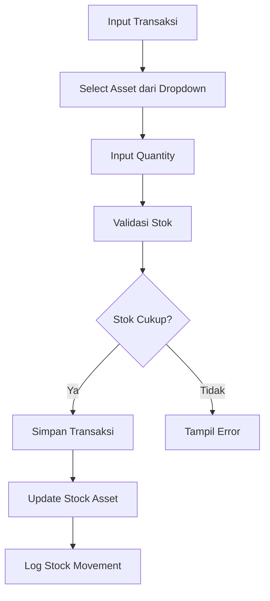

# Rencana Implementasi Sistem Inventory Berbasis Asset

## Tujuan
Mengubah sistem inventory dari input manual nama barang menjadi sistem berbasis asset yang terpusat, dengan tracking stok real-time dan validasi otomatis.

## Arsitektur Database Baru

```mermaid
erDiagram
    assets {
        id PK
        category_id FK
        code string
        name string
        description text
        stock integer
        unit string
        created_at timestamp
        updated_at timestamp
    }

    categories {
        id PK
        name string
        description text
    }

    incoming_transactions {
        id PK
        reference_number string
        transaction_date date
        source string
        notes text
        created_by FK
    }

    outgoing_transactions {
        id PK
        reference_number string
        transaction_date date
        used_by string
        purpose string
        notes text
        created_by FK
    }

    incoming_transaction_details {
        id PK
        incoming_transaction_id FK
        asset_id FK
        quantity integer
        unit string
    }

    outgoing_transaction_details {
        id PK
        outgoing_transaction_id FK
        asset_id FK
        quantity integer
        unit string
    }

    stock_movements {
        id PK
        asset_id FK
        movement_type enum
        quantity integer
        unit string
        transaction_id FK
        transaction_date date
        user_id FK
    }

    assets ||--o{ incoming_transaction_details : "masuk"
    assets ||--o{ outgoing_transaction_details : "keluar"
    assets ||--o{ stock_movements : "pergerakan"
    assets }o--|| categories : "kategori"

    incoming_transactions ||--o{ incoming_transaction_details : "detail"
    outgoing_transactions ||--o{ outgoing_transaction_details : "detail"
```

## Perubahan Utama

### 1. Tabel Assets
- Tambah field `stock` (integer) untuk tracking stok real-time
- Tambah field `unit` (string) untuk satuan default

### 2. Tabel Transaction Details
- Ganti `item_name` dengan `asset_id` (FK ke assets)
- Tetap `quantity` dan `unit` (unit bisa override dari asset default)

### 3. Tabel Stock Movements
- Ganti `item_name` dengan `asset_id` (FK ke assets)
- Tetap fields lainnya

## Flow Bisnis Baru



## Implementasi Step by Step

### Step 1: Migrasi Database
- Tambah kolom `stock` dan `unit` ke tabel `assets`
- Tambah kolom `asset_id` ke `incoming_transaction_details` dan `outgoing_transaction_details`
- Tambah kolom `asset_id` ke `stock_movements`
- Migrasi data existing (jika ada)

### Step 2: Update Models
- Update Asset model: tambah fillable stock, unit
- Update TransactionDetail models: ganti item_name dengan asset_id
- Update StockMovement: ganti item_name dengan asset_id
- Tambah relationships

### Step 3: Update Forms
- Ubah repeater dari TextInput item_name menjadi Select asset
- Tambah display stok tersedia
- Update validation

### Step 4: Update Services
- InventoryService: handle asset_id, kalkulasi stok otomatis
- Validasi stok untuk outgoing
- Update stock movements

### Step 5: Update UI
- Tampilkan stok di select asset
- Alert jika stok rendah
- Dashboard stok

## Keuntungan
- **Akurasi**: Tidak ada typo nama barang
- **Real-time**: Stok selalu update
- **Validasi**: Mencegah over-stock-out
- **Laporan**: Data konsisten
- **Manajemen**: Asset terpusat

## Risiko & Mitigasi
- **Data Migration**: Backup dulu, test migrasi
- **Existing Data**: Handle data lama dengan fallback
- **Performance**: Index pada asset_id
- **UI Complexity**: Training user untuk select asset

## Estimasi Effort
- Database: 2-3 hari
- Models & Services: 3-4 hari
- Forms & UI: 2-3 hari
- Testing: 2 hari
- Total: 9-12 hari

Apakah plan ini sesuai dengan kebutuhan Anda?