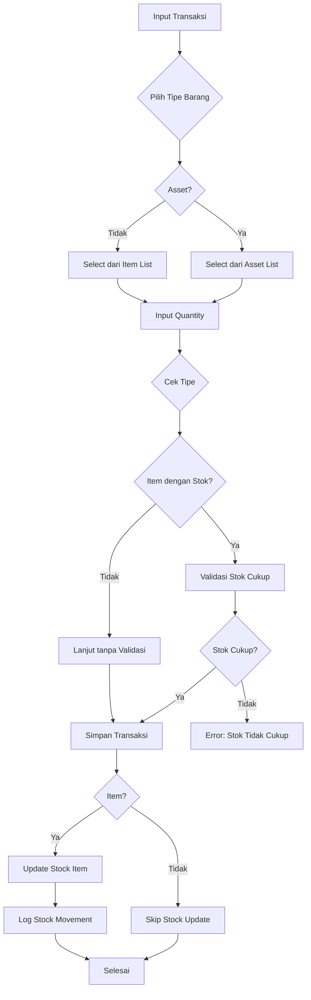

# Arsitektur Sistem Inventory yang Benar

## Klarifikasi Kebutuhan

Berdasarkan penjelasan Anda, sistem inventory memiliki **dua kategori barang berbeda**:

1. **Asset (Habis Pakai)**: ATK, Komputer, perlengkapan kantor
   - Tidak perlu tracking stok karena sekali pakai
   - Hanya sebagai master data referensi

2. **Item/Barang (Konstruksi)**: Semen, batu, material bangunan
   - Perlu tracking stok karena reusable
   - Penting untuk konstruksi/tukang

## Arsitektur Database yang Direkomendasikan

```mermaid
erDiagram
    assets {
        id PK
        category_id FK
        code string
        name string
        description text
        unit string
        created_at timestamp
        updated_at timestamp
    }

    items {
        id PK
        category_id FK
        code string
        name string
        description text
        stock integer
        unit string
        min_stock integer
        created_at timestamp
        updated_at timestamp
    }

    categories {
        id PK
        name string
        type enum "asset/item"
        description text
    }

    incoming_transactions {
        id PK
        reference_number string
        transaction_date date
        source string
        notes text
        created_by FK
    }

    outgoing_transactions {
        id PK
        reference_number string
        transaction_date date
        used_by string
        purpose string
        notes text
        created_by FK
    }

    incoming_transaction_details {
        id PK
        transaction_id FK
        item_type enum "asset/item"
        item_id FK
        quantity integer
        unit string
    }

    outgoing_transaction_details {
        id PK
        transaction_id FK
        item_type enum "asset/item"
        item_id FK
        quantity integer
        unit string
    }

    stock_movements {
        id PK
        item_id FK
        movement_type enum
        quantity integer
        unit string
        transaction_id FK
        transaction_date date
        user_id FK
    }

    assets }o--|| categories : "kategori_asset"
    items }o--|| categories : "kategori_item"
    categories ||--o{ assets : "contains"
    categories ||--o{ items : "contains"

    incoming_transactions ||--o{ incoming_transaction_details : "detail"
    outgoing_transactions ||--o{ outgoing_transaction_details : "detail"

    incoming_transaction_details }o--|| assets : "asset"
    incoming_transaction_details }o--|| items : "item"
    outgoing_transaction_details }o--|| assets : "asset"
    outgoing_transaction_details }o--|| items : "item"

    items ||--o{ stock_movements : "pergerakan"
```

## Penjelasan Arsitektur

### 1. Tabel Items (Baru)
- Mirip dengan Assets tapi untuk material konstruksi
- Memiliki field `stock` untuk tracking real-time
- Memiliki `min_stock` untuk alert stok rendah
- Relasi ke Categories dengan type "item"

### 2. Alternatif Arsitektur Transaction Details

#### Opsi A: Polymorphic dengan item_type (Direkomendasikan)
```sql
incoming_transaction_details (
    id,
    transaction_id,
    item_type ENUM('asset', 'item'),  -- Menentukan tabel referensi
    item_id BIGINT,                   -- ID di tabel assets atau items
    quantity,
    unit
)
```
**Keuntungan:**
- Satu tabel untuk semua tipe
- Mudah query dan maintain
- Fleksibel untuk tipe baru

#### Opsi B: Tabel Terpisah
```sql
incoming_asset_details (
    id,
    transaction_id,
    asset_id FK -> assets,
    quantity,
    unit
)

incoming_item_details (
    id,
    transaction_id,
    item_id FK -> items,
    quantity,
    unit
)
```
**Keuntungan:**
- Lebih strict referential integrity
- Lebih clear untuk reporting
**Kerugian:**
- Lebih banyak tabel
- Lebih kompleks di form (conditional logic)

#### Opsi C: Single Table dengan Nullable FK
```sql
incoming_transaction_details (
    id,
    transaction_id,
    asset_id FK -> assets (nullable),
    item_id FK -> items (nullable),
    quantity,
    unit
)
```
**Keuntungan:**
- Simple structure
**Kerugian:**
- Bisa ada data invalid (kedua FK terisi)
- Sulit enforce business rules

**Rekomendasi: Opsi A** karena paling fleksibel dan maintainable.

### 3. Stock Movement
- Hanya untuk Items (bukan Assets)
- Tracking pergerakan stok material konstruksi

### 4. Categories
- Ditambahkan field `type` untuk membedakan kategori asset vs item

## Flow Bisnis



## Implementasi Step by Step

### Step 1: Database Migration
```sql
-- Tambah tabel items
CREATE TABLE items (
    id BIGINT PRIMARY KEY,
    category_id BIGINT FK,
    code VARCHAR UNIQUE,
    name VARCHAR,
    description TEXT,
    stock INTEGER DEFAULT 0,
    unit VARCHAR,
    min_stock INTEGER DEFAULT 0,
    created_at TIMESTAMP,
    updated_at TIMESTAMP
);

-- Modifikasi categories
ALTER TABLE categories ADD COLUMN type ENUM('asset', 'item') DEFAULT 'asset';

-- Modifikasi transaction_details
ALTER TABLE incoming_transaction_details ADD COLUMN item_type ENUM('asset', 'item');
ALTER TABLE incoming_transaction_details ADD COLUMN item_id BIGINT;
ALTER TABLE outgoing_transaction_details ADD COLUMN item_type ENUM('asset', 'item');
ALTER TABLE outgoing_transaction_details ADD COLUMN item_id BIGINT;

-- Hapus kolom lama jika perlu
-- ALTER TABLE incoming_transaction_details DROP COLUMN item_name;
-- ALTER TABLE outgoing_transaction_details DROP COLUMN item_name;
```

### Step 2: Update Models
- Buat model Item
- Update TransactionDetail models dengan polymorphic relationship
- Update Category model

### Step 3: Update Forms
- Tambah select untuk tipe barang (Asset/Item)
- Conditional dropdown berdasarkan tipe
- Tampilkan stok untuk Items

### Step 4: Update Services
- InventoryService handle polymorphic relationship
- Validasi stok hanya untuk Items
- Update stock otomatis untuk Items

## Keuntungan Arsitektur Ini

1. **Fleksibilitas**: Mendukung dua tipe inventory berbeda
2. **Skalabilitas**: Mudah tambah tipe baru di masa depan
3. **Akurasi**: Tracking stok hanya untuk yang perlu
4. **Performa**: Tidak over-engineer untuk Asset
5. **Maintainability**: Kode terorganisir berdasarkan fungsi

## Estimasi Effort
- Database: 1-2 hari
- Models: 2 hari
- Forms: 3 hari
- Services: 2 hari
- Testing: 2 hari
- **Total: 10 hari**

Apakah arsitektur ini sesuai dengan visi Anda?